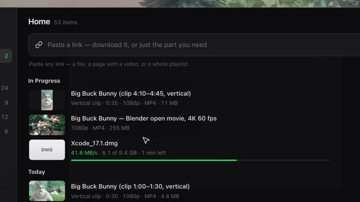

# Lynx Download Manager for Mac: releases

Signed builds of [Lynx Download Manager](https://www.lynxdownloadmanager.com/?utm_source=github&utm_medium=directory&utm_campaign=directories-2026q4), the download manager for Macs with Apple silicon. The app's updater and the Download button on the website fetch their files from this repository's [Releases](https://github.com/sayemmotionart-jpg/lynx-releases/releases). There is no source code here.



**Download Lynx:** [lynxdownloadmanager.com/download](https://www.lynxdownloadmanager.com/download?utm_source=github&utm_medium=directory&utm_campaign=directories-2026q4). The website always links the latest build.

## What it does

- Splits big downloads across up to 16 connections and resumes them after a dropped connection, sleep or a restart (when the server supports resuming).
- Catches large downloads from Chrome, Edge, Brave and Arc, with the Lynx browser extension.
- Clip Download saves just a time range of a video as its own file. On long videos, only that part is fetched.
- Lynx Notch shows download progress in the MacBook notch.

Free to use, with limits listed on the [pricing page](https://www.lynxdownloadmanager.com/pricing). Every Pro feature is on for 14 days after you install, with no account and no card.

## Requirements

- A Mac with Apple silicon (M1 or later) and macOS 11 Big Sur or later.
- Lynx Notch needs macOS 14 Sonoma or later.
- No Intel build yet: [join the wait-list](https://www.lynxdownloadmanager.com/download).

## Signed and notarized by Apple

Since 1.0.7, every build is signed with a Developer ID and notarized by Apple, so it opens like any other Mac app. To check your copy:

```sh
spctl -a -vv "/Applications/Lynx Download Manager.app"
```

It should print:

```text
accepted
source=Notarized Developer ID
origin=Developer ID Application: Md Naimul Islam Sayem (FHHJ3MY2YL)
```

## Checksums

| Version | File | SHA-256 |
|---|---|---|
| 1.0.7 | `Lynx_1.0.7_aarch64.dmg` | `6c138c47f88ef5ad9d844a4ed7b9747cd548d8e40ee9b8704666a12837624b51` |

Check a download with `shasum -a 256 ~/Downloads/Lynx_1.0.7_aarch64.dmg`.

## More

- Is it safe? What Lynx sends, how updates are verified, how to report a problem: [lynxdownloadmanager.com/security](https://www.lynxdownloadmanager.com/security)
- Release notes: [lynxdownloadmanager.com/changelog](https://www.lynxdownloadmanager.com/changelog)
- Privacy: downloads run on your Mac and never pass through our servers ([privacy policy](https://www.lynxdownloadmanager.com/privacy))
- Help and support: [lynxdownloadmanager.com/support](https://www.lynxdownloadmanager.com/support) · support@lynxdownloadmanager.com
